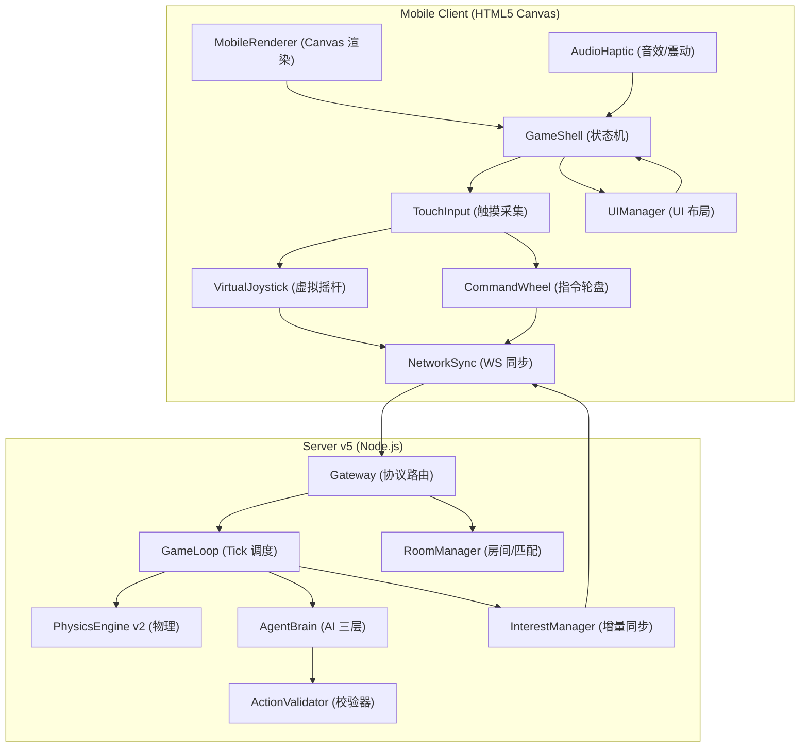
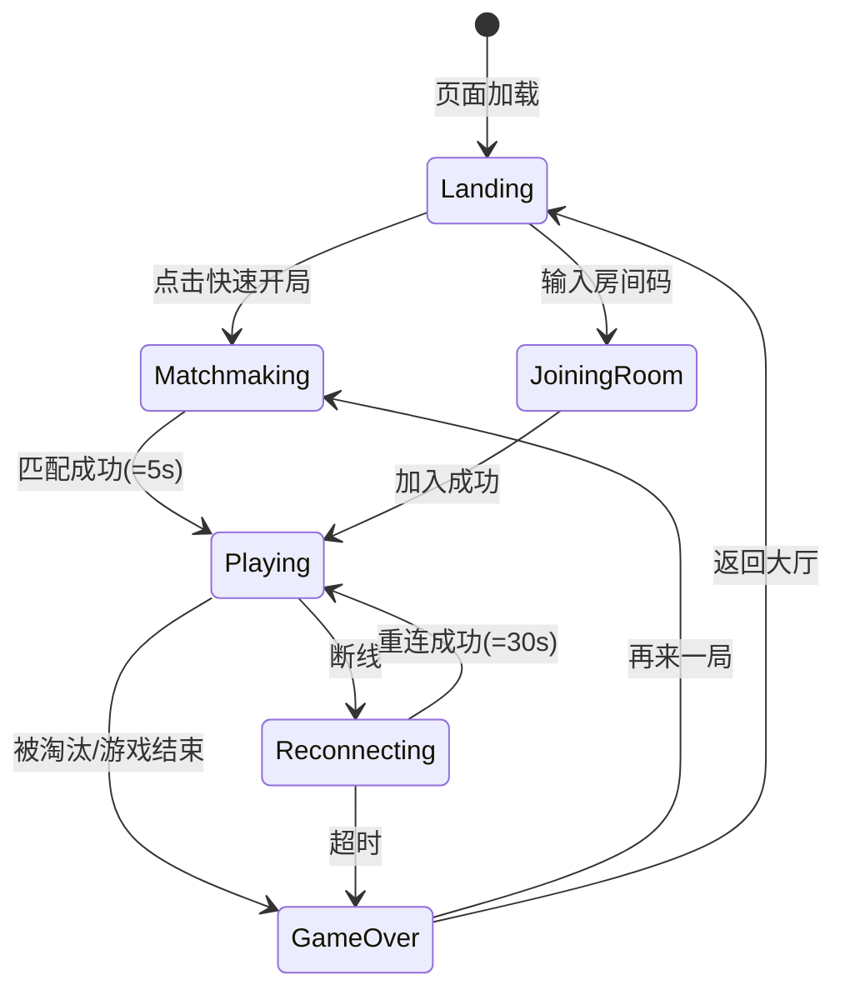
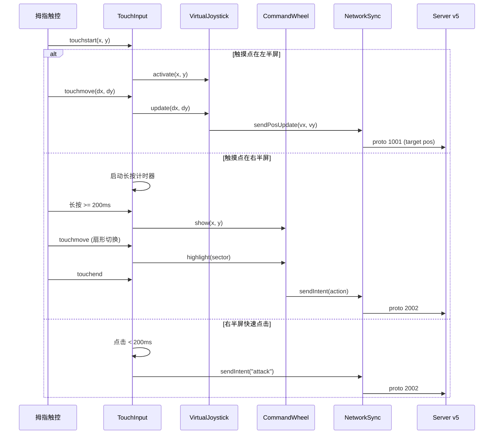

# 移动端优先重构 - 技术设计规格说明书

Feature Name: mobile-first-redesign
Updated: 2026-06-22

## Description

将《共生球域》从固定 800x600 桌面端 Canvas 重构为移动端/平板优先的触屏游戏。核心变更包括：响应式全屏画布、虚拟摇杆操控、指令轮盘交互、自适应 UI 布局、移动网络优化。服务端 AI/物理/同步模块最大限度复用现有架构，新增房间匹配和游戏状态机。

## Architecture

### 系统总览



### 客户端状态机



### 触摸交互数据流



## Components and Interfaces

### 1. GameShell (client/src/GameShell.js)

游戏状态机控制器，负责状态切换、模块加载、生命周期管理。

```
接口:
  constructor(config)
  start()                    // 初始化所有子系统
  switchState(newState)      // 切换状态: landing|matchmaking|playing|gameover|reconnecting
  getState()                 // 返回当前状态
  cleanup()                  // 释放资源
```

### 2. TouchInput (client/src/TouchInput.js)

统一触摸事件管理，负责多点触控的识别、分区和分发。

```
接口:
  constructor(config)
  registerZone(zoneId, rect) // 注册触控区域
  onGesture(zoneId, cb)      // 手势回调
  enable() / disable()
```

触控分区:
- 左半屏 (0%~45%): 摇杆区域
- 右半屏 (55%~100%): 指令区域
- 中间缓冲 (45%~55%): 缓冲区避免误触

手势识别:
- `tap` (< 200ms, < 10px): 快速点击
- `longpress` (>= 200ms): 长按
- `pan` (move after touch): 拖拽
- `doubletap` (两次 tap < 300ms): 双击

### 3. VirtualJoystick (client/src/VirtualJoystick.js)

跟随式虚拟摇杆，触摸点为中心。

```
接口:
  constructor(opts)          // {radius: 60, deadZone: 5}
  activate(x, y)             // 在(x,y)激活
  update(dx, dy)             // 更新拖拽位移
  release()                  // 释放
  getDirection()             // 返回 {vx, vy, magnitude}
  render(ctx)                // 绘制在 overlay canvas
```

设计参数:
- 外圈半径: 60px (拇指活动范围)
- 死区半径: 5px (防止微动漂移)
- 拖拽缩放: dx/80 映射到 0~1 速度系数

### 4. CommandWheel (client/src/CommandWheel.js)

4 扇区环形菜单，长按触发。

```
接口:
  constructor(opts)          // {sectors: [...], radius: 100, innerRadius: 40}
  show(x, y)                 // 在(x,y)显示
  updateAngle(angle)         // 更新当前指向角度
  select()                   // 确认选择
  dismiss()                  // 关闭
  getSelectedAction()        // 返回 'attack'|'retreat'|'merge_rally'|'free_roam'
  render(ctx)                // 绘制
```

扇区布局 (从 12 点顺时针):
| 角度 | 指令 | 图标 | 颜色 |
|------|------|------|------|
| 315~45 | 进攻 (attack) | 剑 | #e74c3c |
| 45~135 | 集合 (merge_rally) | 旗帜 | #9b59b6 |
| 135~225 | 撤退 (retreat) | 盾牌 | #e67e22 |
| 225~315 | 自由行动 (free_roam) | 鸟 | #7f8c8d |

### 5. MobileRenderer (client/src/MobileRenderer.js)

响应式 Canvas 渲染器。

```
接口:
  constructor(container, gameState)
  resize()                   // 适配 viewport
  render(deltaTime)          // 主循环渲染
  getViewportTransform()     // 返回 {scale, offsetX, offsetY}
  updateCamera(target)       // 平滑跟踪目标实体
```

渲染特性:
- Canvas 自动适配 devicePixelRatio
- 相机平滑跟随 (lerp factor 0.1)
- 视野缩放: viewport = radius * 4（移动端视野比桌面宽）

### 6. AudioHaptic (client/src/AudioHaptic.js)

Web Audio API 程序化音效 + Vibration API。

```
接口:
  constructor()
  playBeat()                 // 吞噬音效 (freq sweep 800->400Hz, 80ms)
  playDeath()                // 死亡音效 (noise burst, 300ms)
  playCommandAck()           // 指令确认音 (triangle wave, 100ms)
  playAmbient()              // 背景白噪声 (low gain)
  vibrate(pattern)           // 触觉反馈 [100, 50, 100] = 100ms振/50ms停/100ms振
  setMute(muted)             // 静音开关
```

### 7. UIManager (client/src/UIManager.js)

移动端 UI 布局管理器。

```
接口:
  constructor()
  renderTopBar(data)         // 顶部: 质量/排名
  renderMinimap(entities)    // 右上: 小地图
  showToast(msg, duration)   // 浮动提示
  showOverlay(type, data)    // 结算/连接中断覆盖层
  hideOverlay()
```

### 8. RoomManager (server/src/room/RoomManager.js)

服务端新增模块，管理房间创建、匹配、机器人填充。

```
接口:
  constructor(config)        // {maxPlayersPerRoom: 8, fillTimeout: 3000}
  createRoom(roomId)         // 创建新房间
  joinMatchmaking(player)    // 加入匹配队列
  joinRoomByCode(player, code) // 通过房间码加入
  fillWithBots(room)         // 机器人填充
  getMatchStatus()           // 返回匹配状态
```

匹配算法:
1. 玩家进入队列后，3 秒内等待其他玩家
2. 3 秒到时，累积的玩家分入同一房间
3. 不足 8 人时用机器人填充至 8 人
4. 创建新房间后立即开始游戏

## Data Models

### GameState (客户端)

```javascript
{
  phase: 'landing',          // landing|matchmaking|playing|gameover|reconnecting
  player: {
    id: 'player_xxx',
    name: 'Player_123',
    masterEntityId: 'master_player_xxx',
    agentEntityId: 'agent_player_xxx',
  },
  entities: [],              // 当前已知实体列表
  master: null,              // 本体实体引用
  agent: null,               // Agent 实体引用
  input: {
    joystickActive: false,
    joystickDir: { vx: 0, vy: 0 },
    wheelActive: false,
    pendingIntent: null,
  },
  ui: {
    topBar: { mass: 0, rank: 8, leaderName: '' },
    toast: { visible: false, message: '', timer: 0 },
    overlay: null,           // 'gameover'|'reconnecting'|null
  },
  audio: {
    muted: false,
    context: null,
  },
  stats: {
    joinTime: 0,
    peakMass: 0,
    eliminations: 0,
  },
}
```

### 服务端扩展配置

```javascript
// MobileGameConfig (extends GameConfig)
{
  MAP_WIDTH: 8000,
  MAP_HEIGHT: 8000,
  MAX_PLAYERS_PER_ROOM: 8,
  MOBILE_SEND_RATE: 10,     // Hz, 移动端降低同步频率
  MOBILE_FOOD_THROTTLE: 3,  // tick, 食物更新节流
  BOT_FILL_COUNT: 8,        // 机器人填充目标
  MATCHMAKING_TIMEOUT: 3000,// ms, 匹配等待时间
  INITIAL_FOOD_COUNT: 120,  // 初始食物数量(地图小,密度不变)
}
```

## Correctness Properties

### 不变量

1. **实体一致性**: 服务端是游戏状态的唯一权威源。客户端预测仅用于本地渲染平滑，不用于判定。
2. **指令幂等性**: 每个 Intent 携带唯一 `intent_id`，服务端在 500ms 窗口内丢弃重复 Intent。
3. **摇杆死区**: 位移小于 5px 时不发送移动指令，避免网络抖动。
4. **Canvas 像素比**: `canvas.width = viewportWidth * devicePixelRatio`, `canvas.style.width = 100vw`，确保物理像素正确。
5. **同步帧最大实体**: 单次 delta sync 变化实体超过 50 时自动降级为 fullSync。
6. **相机边界**: 相机中心不允许超出地图边界 ±100px，防止视口空白。

### 约束

1. 本体移动速度不超过 `BaseSpeed(mass) = v_max * (m_min / mass)^a` (从 GameConfig 继承)
2. 摇杆最大输出位移 80px 对应 100% 速度
3. 指令轮盘半径 100px，内圈 40px，扇形间有 5° 间隙防止误触
4. Toast 通知同时最多显示 1 条，新通知顶替旧通知
5. FPS 低于 20 时自动降低渲染质量 (跳过粒子特效、减少描边复杂度)

## Error Handling

| 场景 | 处理策略 |
|------|---------|
| WebSocket 连接失败 | 显示"无法连接服务器"，提供重试按钮，3 次失败后建议刷新 |
| 匹配超时 (10s) | 自动用 8 机器人创建单人对战房间 |
| Canvas 不支持 | 显示文字提示"请使用现代浏览器" |
| Web Audio API 不支持 | 静默降级，不弹错误提示 |
| Vibration API 不支持 | 跳过震动，正常游戏 |
| 服务端房间已满 | 新建房间并加入，不报错 |
| 帧率持续低于 15 | 降低渲染质量（跳帧模式），在连续 3 帧低于 15FPS 后触发 |
| 设备内存不足 | 减少实体缓存（只保留最近 2 次 fullSync 的快照） |
| 重连后 entity_id 冲突 | 以服务端 fullSync 为准，丢弃客户端本地状态 |

## Test Strategy

### 单元测试

| 模块 | 测试目标 |
|------|---------|
| TouchInput | 手势识别正确（tap/longpress/pan/doubletap） |
| VirtualJoystick | 方向向量计算精度（dx=80,dy=0 应输出 vx=1,vy=0） |
| CommandWheel | 角度->扇区映射（0°/90°/180°/270° 对应正确的指令） |
| RoomManager | 机器人填充逻辑（3 人加入+5 机器人=8 人房间） |
| MobileGameConfig | 配置值正确继承和覆盖 |

### 集成测试

| 场景 | 验证点 |
|------|--------|
| 完整对战流程 | 开局:匹配:对战:结算 全链路 |
| 断线重连 | 断线 10s 后重连，状态恢复 |
| 指令轮盘 | 长按->滑动->释放，服务器收到正确 Intent |
| 机器人填充 | 单人开局，房间内有 8 个实体（1 人+7 机器人） |
| 移动端同步 | sendRate=10Hz，deltaSync 正常，fullSync <= 1/5s |

### 移动端兼容性测试

- iOS Safari 15+
- Android Chrome 100+
- iPad Safari (横竖屏)
- 微信内置浏览器

## References

[^1]: (requirements.md) - 移动端优先重构需求文档
[^2]: (../symbiotic-sphere-game/design.md) - 原始技术设计文档
[^3]: (../../blob-battle-mvp/server/src/config/GameConfig.js) - 游戏核心配置
[^4]: (../../blob-battle-mvp/server/src/core/GameLoop.js) - 游戏主循环
