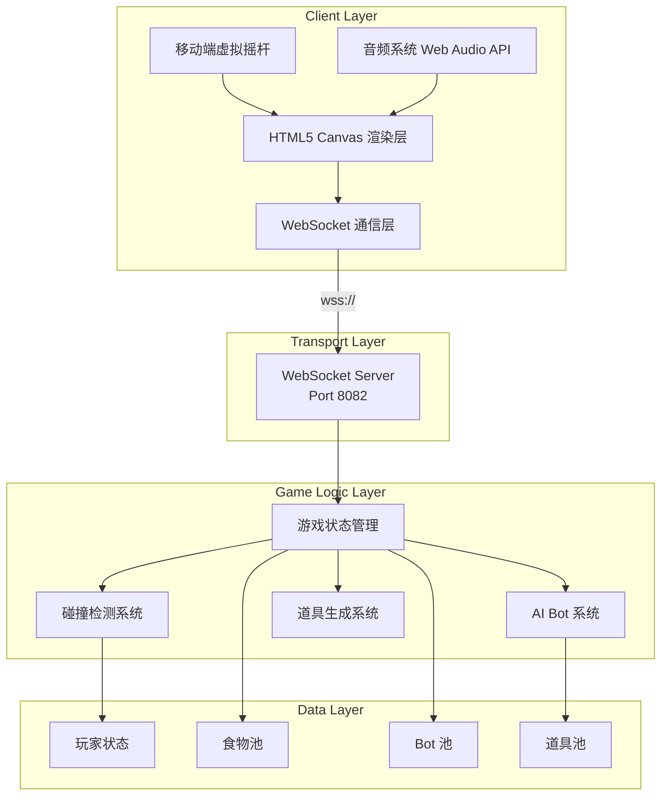

# 🎮 球球大作战 - Blob Battle

[](https://opensource.org/licenses/MIT)
[](https://nodejs.org/)
[](https://developer.mozilla.org/en-US/docs/Web/API/WebSocket)

> 一个基于 WebSocket 的实时多人在线竞技游戏，完整复刻经典"球球大作战"核心玩法，支持桌面端和移动端跨平台对战。

## 📸 游戏截图

```
[游戏画面示意]
┌─────────────────────────────────────────────────────────┐
│  🔴 状态: 游戏中    🎮 玩家: Player-1    📏 质量: 45.2   │
│  👥 队伍: 红队                                          │
│                                                         │
│     🏆 排行榜                 ┌────────────────────┐   │
│     1. Player-1  45.2         │   🟢 加速        │   │
│     2. Bot-4f2a  38.7         │                    │   │
│     3. Bot-8a91  32.1         │  ⭐ 粒子特效      │   │
│                               │      🎮           │   │
│     团队比分                  │   玩家角色        │   │
│     🔴 红队: 156              │    发光效果       │   │
│     🔵 蓝队: 142              └────────────────────┘   │
│     🟢 绿队: 98                                        │
│     🟡 黄队: 87                                        │
│                                                         │
│  [虚拟摇杆] ⚡ 分裂  💫 吐孢子                           │
│  🛡️ 保护  ⚔️ 进攻  👥 集合                              │
└─────────────────────────────────────────────────────────┘
```

## 🎯 产品定位

**球球大作战 (Blob Battle)** 是一款轻量级的实时多人在线竞技网页游戏，目标用户为：

- 🎮 **休闲玩家**：随时随地打开浏览器即可游玩
- 📱 **移动端用户**：支持触屏操作，虚拟摇杆控制
- 👥 **社交玩家**：团队模式支持4队对战，配合策略取胜

**核心玩法**：控制小球吞噬食物和其他玩家，通过分裂、吐孢子等策略不断变大，最终成为地图霸主。

## ✨ 功能特性

### 🎮 核心游戏机制
- ✅ **实时多人对战**：WebSocket 低延迟通信，支持多人同屏竞技
- ✅ **吞噬成长**：吃掉食物和其他玩家，质量不断增加
- ✅ **分裂机制**：按 W 键或点击分裂按钮，将球分成两个
- ✅ **吐孢子**：按 S 键或点击吐孢子按钮，吐出小孢子攻击或逃跑
- ✅ **自动合并**：分裂后 5 秒自动合并
- ✅ **边界限制**：限制在地图范围内移动

### 🎨 视觉特效
- ✅ **60fps 流畅画面**：基于 requestAnimationFrame 的高性能渲染
- ✅ **插值动画**：服务器状态插值，视觉平滑过渡
- ✅ **粒子系统**：吃掉食物时的爆炸特效
- ✅ **发光效果**：皮肤发光、阴影渲染
- ✅ **平滑视角**：相机跟随玩家，平滑移动

### 🔊 音效系统
- ✅ **程序化音效**：使用 Web Audio API 生成，无需外部文件
- ✅ **吃食物音效**：清脆的提示音
- ✅ **分裂音效**：低沉的反馈音
- ✅ **吐孢子音效**：射击感音效
- ✅ **道具音效**：获得和使用道具的提示
- ✅ **升级音效**：段位提升庆祝音效

### 📱 移动端支持
- ✅ **虚拟摇杆**：左下角虚拟摇杆，支持拖拽控制方向
- ✅ **触摸按钮**：右下角分裂/吐孢子按钮
- ✅ **响应式布局**：自动检测设备类型，切换控制模式
- ✅ **触摸优化**：防止误触、延迟等问题

### 👥 团队模式
- ✅ **4队对战**：红队、蓝队、绿队、黄队
- ✅ **自动平衡**：新玩家自动分配到人数最少的队伍
- ✅ **团队比分**：实时显示各队总分
- ✅ **出生点**：不同队伍从不同位置出生

### 🎨 皮肤系统
- ✅ **10款皮肤**：经典蓝、热情红、自然绿、神秘紫、阳光黄、活力橙等
- ✅ **解锁机制**：部分皮肤需要达成条件解锁（如达到50质量、连续登录7天）
- ✅ **视觉效果**：发光、渐变等特殊效果
- ✅ **团队覆盖**：团队模式下自动使用队伍颜色

### 🏆 段位系统
- ✅ **7个段位**：青铜→白银→黄金→铂金→钻石→大师→王者
- ✅ **段位图标**：每个段位有独特的图标显示
- ✅ **排行榜**：实时显示全服玩家排名
- ✅ **分数计算**：根据质量、击杀数、存活时间综合计算

### ⚡ 道具系统
- ✅ **4种道具**：
  - ⚡ 加速：移动速度提升 50%，持续 5 秒
  - 🛡️ 护盾：免疫一次被吞噬，持续 3 秒
  - 🧲 磁力：自动吸附周围食物，持续 4 秒
  - 📈 生长：立即增加 20% 质量
- ✅ **道具生成**：每 15 秒在地图上随机生成
- ✅ **效果通知**：获得道具时显示提示

## 🏗️ 技术架构

### 系统架构图



### 技术栈

| 层级 | 技术 | 说明 |
|------|------|------|
| **前端** | HTML5 Canvas | 游戏画面渲染 |
| | WebSocket API | 实时通信 |
| | Web Audio API | 程序化音效 |
| **后端** | Node.js | 服务器运行环境 |
| | ws (WebSocket) | WebSocket 服务器库 |
| | uuid | 唯一标识生成 |
| **通信** | 自定义二进制协议 | 高效的实时数据传输 |

### 网络协议

```
Client ←→ Server 消息协议:

📥 客户端发送:
├── proto_id: 1001  - 移动指令 {x, y}
├── proto_id: 1002  - 分裂
├── proto_id: 1003  - 吐孢子 {angle}
├── proto_id: 1004  - 发送消息 {message}
├── proto_id: 1005  - 选择队伍 {team}
└── proto_id: 1006  - 选择皮肤 {skin_id}

📤 服务器广播:
├── proto_id: 2001  - 游戏状态 {entities, foods, ejectedMasses}
├── proto_id: 2002  - 排行榜 {players}
├── proto_id: 2003  - 玩家消息 {sender, message}
├── proto_id: 7001  - 道具获得通知
└── proto_id: 7002  - 段位升级通知
```

## 🚀 快速开始

### 环境要求

- **Node.js**: 18.0 或更高版本
- **浏览器**: Chrome 90+, Firefox 90+, Safari 15+, Edge 90+
- **网络**: 支持 WebSocket 的网络环境

### 安装步骤

```bash
# 1. 克隆仓库
git clone https://github.com/hongmaple0820/qiuqiu-game.git
cd qiuqiu-game

# 2. 安装依赖
cd blob-battle-mvp
npm install

# 3. 启动游戏服务器
cd server
npm install
node server-v3.js

# 4. 启动静态文件服务器（新终端）
cd ../client
npx serve -p 8083
```

### 访问游戏

```
本地开发环境:
├── 游戏客户端: http://localhost:8083
├── 游戏服务器: ws://localhost:8082
└── 直接打开: blob-battle-mvp/client/index-v3.html

预览环境:
└── https://8083-4f1dea0e6d4aebd1.monkeycode-ai.online/client/index-v3.html
```

## 🎮 游戏操作指南

### 桌面端

| 操作 | 按键 | 说明 |
|------|------|------|
| 移动 | 🖱️ 鼠标 | 移动鼠标控制方向 |
| 分裂 | W 键 / 点击按钮 | 将球分成两个 |
| 吐孢子 | S 键 / 点击按钮 | 吐出小孢子攻击或逃跑 |
| 发送指令 | Enter 键 | 发送快捷指令 |

### 移动端

| 操作 | 方式 | 说明 |
|------|------|------|
| 移动 | 虚拟摇杆 | 左下角拖拽控制方向 |
| 分裂 | ⚡ 按钮 | 右下角大按钮 |
| 吐孢子 | 💫 按钮 | 右下角小按钮 |
| 快捷指令 | 点击快捷按钮 | 保护/进攻/集合 |

### 游戏策略

1. **前期发育**：多吃食物，避免与比自己大的球接触
2. **分裂追击**：当接近比自己小的球时，使用分裂快速靠近
3. **吐孢子逃跑**：当被大球追击时，吐孢子可以加速逃跑
4. **团队配合**：团队模式下，小玩家可以保护大玩家
5. **道具利用**：优先获取加速和护盾道具，增加生存率

## 📊 项目结构

```
blob-battle-mvp/
├── 📁 client/                    # 游戏客户端
│   ├── index-v3.html            # 游戏主页面（完整版）
│   ├── audio.js                 # 音效系统
│   └── ...                      # 其他版本文件
├── 📁 server/                    # 游戏服务器
│   ├── server-v3.js             # 游戏服务器主文件（V3完整版）
│   └── package.json             # 服务器依赖
├── 📁 docs/                      # 文档（待完善）
├── package.json                 # 项目依赖
├── start.sh                     # 启动脚本（Mac/Linux）
└── start-v2.sh                  # 启动脚本 V2

其他项目（独立）：
├── qiuqiu-game-web/             # Vue3 + FastAPI 技能追踪系统
└── src/                         # Python 后端模型（技能追踪）
```

## 🛣️ 路线图

### ✅ 已完成 (V3.0)
- [x] 60fps 流畅画面和插值动画
- [x] 音效系统（程序化音频）
- [x] 移动端虚拟摇杆控制
- [x] 团队模式（4队对战）
- [x] 段位系统（青铜到王者）
- [x] 皮肤系统（10款皮肤）
- [x] 粒子特效和发光效果
- [x] 道具系统（4种道具）
- [x] 分裂后自动合并机制
- [x] AI Bot 系统

### 🚧 计划中 (V4.0)
- [ ] 用户账户系统（注册/登录）
- [ ] 数据持久化（数据库存储）
- [ ] 游戏房间系统
- [ ] 好友系统
- [ ] 战绩统计和历史记录
- [ ] 更多游戏模式（限时赛、排位赛）
- [ ] 自定义房间

## 🤝 贡献指南

欢迎提交 Issue 和 Pull Request！

1. Fork 本仓库
2. 创建你的特性分支 (`git checkout -b feature/AmazingFeature`)
3. 提交你的更改 (`git commit -m 'Add some AmazingFeature'`)
4. 推送到分支 (`git push origin feature/AmazingFeature`)
5. 打开一个 Pull Request

## 📝 许可证

本项目采用 [MIT 许可证](LICENSE) 开源。

## 🙏 致谢

- 游戏灵感来源于经典的 [agar.io](https://agar.io)
- 图标来自 [Twemoji](https://twemoji.twitter.com/)
- 颜色方案参考 Material Design

---

<p align="center">
  <strong>🎮 开始你的球球大作战之旅！</strong><br>
  <a href="https://8083-4f1dea0e6d4aebd1.monkeycode-ai.online/client/index-v3.html">在线试玩</a> •
  <a href="blob-battle-mvp/client/index-v3.html">本地运行</a> •
  <a href="blob-battle-mvp/docs/">开发文档</a>
</p>
